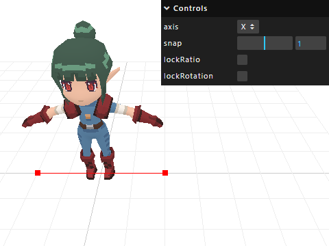

# Putty Controls

Putty Controls is a Three.js module that lets you scale and rotate an object between two points.

## Download

Link: [src/js/PuttyControls.js](src/js/PuttyControls.js)

## Import

```import { PuttyControls } from 'src/js/PuttyControls.js';```

## Example

```
// Create controls
const puttyControls = new PuttyControls(camera, renderer.domElement);
const gizmo = puttyControls.getHelper();
scene.add(gizmo);

// Attach to any 3D object
puttyControls.attach(mesh);
```

## Demo

Link: [https://doppl3r.github.io/putty-controls/demo/](https://doppl3r.github.io/putty-controls/demo/)

## Screenshot



## Local Development

- Clone repo: `git clone https://github.com/doppl3r/putty-controls`
- Open project in VS Code
- Open Terminal: `View > Terminal`
- Install NodeJS package libraries: `npm install`
- Run development libraries `npm run dev`
- Use the link it provides. Ex: `http://localhost:5173`

## Vite

This example uses [Vite](https://vitejs.dev) for **hosting** a local environment and includes commands to **package** for web (similar to Webpack).

## Vue.js

[Vue.js](https://vuejs.org/) is used for the game UI, and leverages the latest **Composition API** introduced in version 3. This JavaScript framework is *"An approachable, performant and versatile framework for building web user interfaces"*.

## Assets
- All 3D models and textures were designed by doppl3r (Jacob DeBenedetto), and can be used on any project with proper credit.